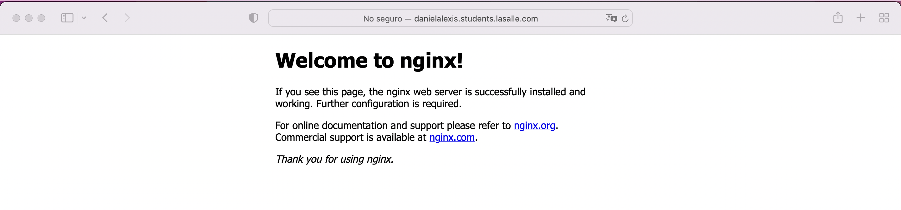
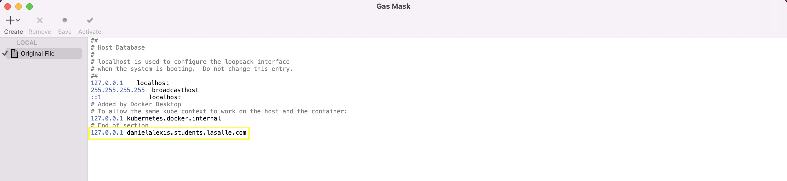
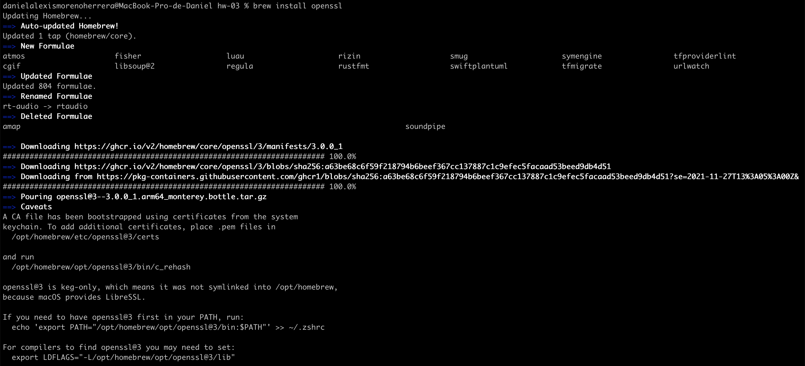
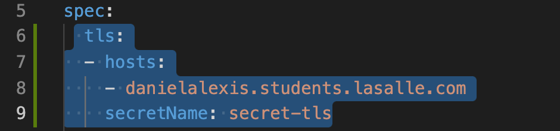
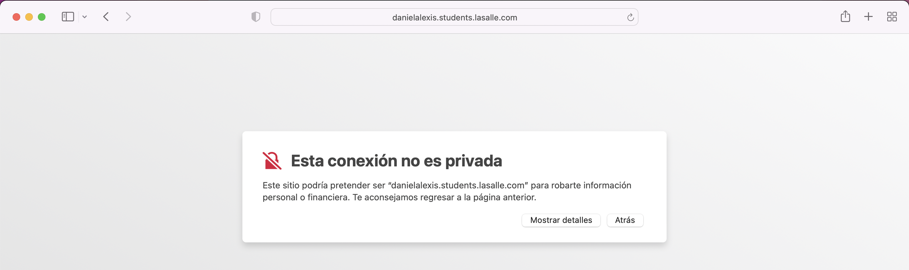
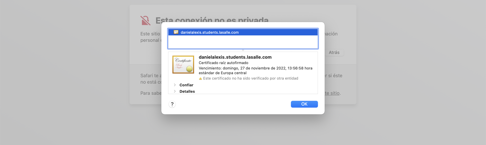
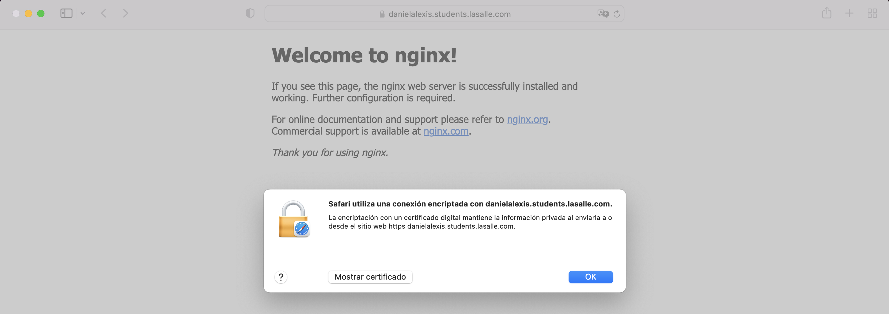

# Answer 1

_Explicacion_

Ingress

**A. A continuación, tras haber expuesto el servicio en el puerto 80, se deberá acceder a la página principal de Nginx a través de la siguiente URL:**

_Respuesta_

1. Primero se crea un deployment con el siguiente comando y fichero:

`kubectl apply -f deployment.yml`

2. Despues me genero un service con el siguiente comando y fichero:

`kubectl apply -f service.yml`

3. Me genero un ingress con el siguiente comando y fichero:

`kubectl create -f ingress.yml`

4. Se modifica el archivo host con el DNS que agregue en el _ingress.yml_

5. Se hace un minikube tunnel para exponer los puertos

`minikube tunnel`

---

**B. Una vez realizadas las pruebas con el protocolo HTTP, se pide acceder al servicio mediante la utilización del protocolo HTTPS**

1. Se instalo el OpenSSL mediante HomeBrew

2. Genere las llaves codificadas mediante OpenSSL con el siguiente comando:

`OpenSSL genrsa -out ca.key 2048`

3. Genere el certificado valido por 365 dias con el siguiente comando:

`openssl req -x509 -new -nodes -days 365 -key ca.key -out ca.crt -subj "/CN=danielalexis.students.lasalle.com"`

4. Genere el secret con el siguiente comando:

`kubectl create secret tls secret-tls --key ca.key --cert ca.crt`

5. Aplique cambios en el ingress mediante el siguiente comando:

`kubectl apply -f ingress.yml`

Se agrego esto:

6. Se visualiza el sitio con el certificado SSL

