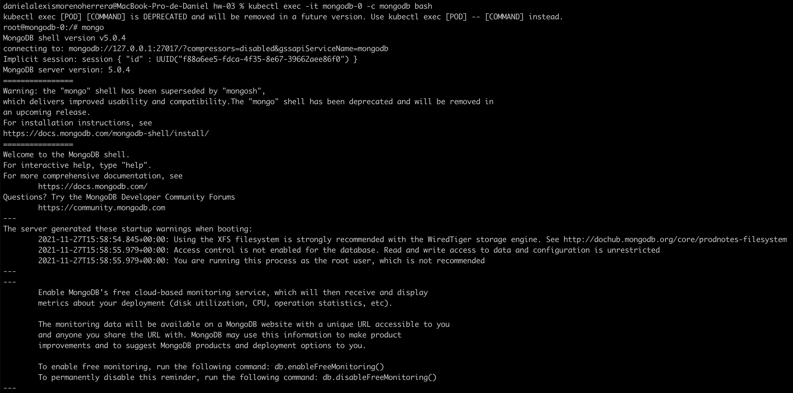
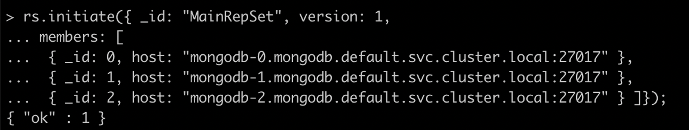
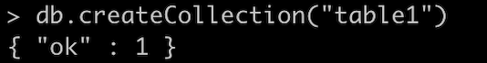
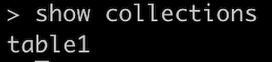
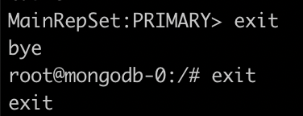
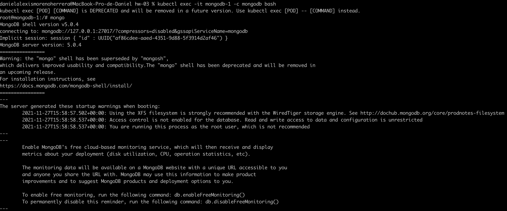
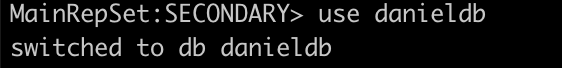
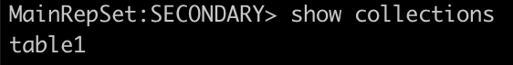
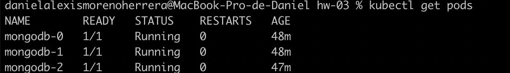
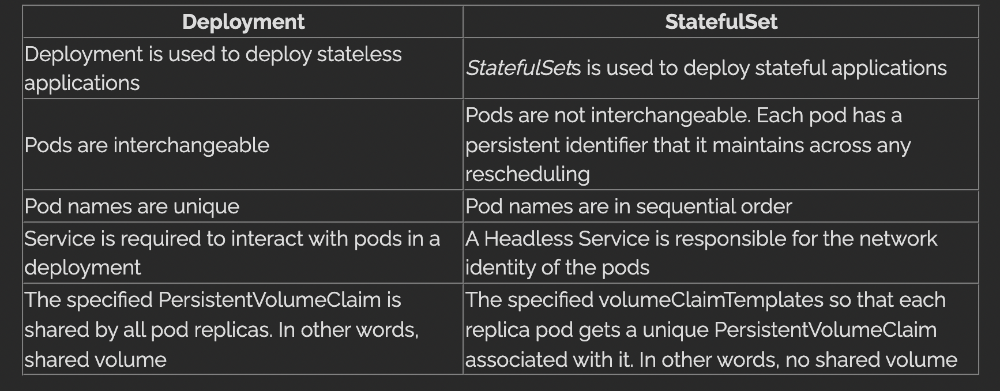

# Answer 2

**Crear un StatefulSet con 3 instancias de MongoDB**

* Habilitar el clúster de Mongo DB
* Realizar una operación en una de las instancias a nivel de configuración y verificar que el cambio se ha aplicado al resto de instancias

---

1. Se genera un **service** nuevo llamado _serviceStatefulSet.yml_ con el siguiente comando:

`kubectl create -f serviceStatefulSet.yml`

2. Se genera un **statefulset** con la imagen de mongodb con el siguiente comando:

`kubectl create -f statefulset.yml`

3. Ingreso al bash de mongo db con el siguiente comando:

`kubectl exec -it mongodb-0 -c mongodb bash`

4. Se revisa el hostname de mongodb con el siguiente comando:

`hostname -f`

5. Despues en el bash coloco la siguiente linea para entrar al shell de mongodb:

`mongo`

6. Se habilita el cluster para mongoDb con el siguiente comando:

7. Creo una nueva db personalizada donde agrego mi nueva coleccion:

`use danieldb`

1. Creo una tabla con mongodb llamada "table1" con el siguiente comando:

`db.createCollection("table1")`

8. Muestro la tabla con el siguiente comando:

`show collections`

9. Salgo del pod para acceder a otro y verificar que los datos esten persistidos en otro pod

10. Accedo a otro pod con el siguiente comando:

`kubectl exec -it mongodb-1 -c mongodb bash`

11. Como entro con Secondary, hay que indicar que Secondary esta Ok con el siguiente comando:

`rs.secondaryOk()`

12. Me cambio a la base de datos personalizada con el siguiente comando:

`use danieldb`

13. Muestro la misma coleccion en otro pod

---

* Diferencias que existiría si el montaje se hubiera realizado con el objeto de
ReplicaSet

La diferencia es que en el ReplicaSet se genera las replicas con un hash aleatorio, mientras que en en un Statefulset se genera de manera consecutiva como vemos a continuacion:

**StatefulSet Pods**

**ReplicaSet Pods**

Ademas que en un statefulset cada pod tiene un unico PersistentVolumeClaim asociado, mientras que el replicaSet tienen un volumen compartido.

Para más diferencias, agrego imagen a continacion:

Referencia: https://www.baeldung.com/ops/kubernetes-deployment-vs-statefulsets