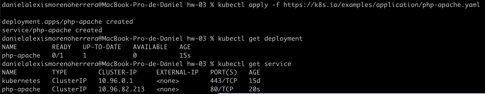
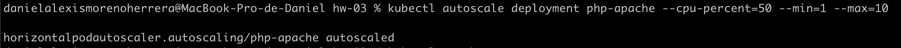
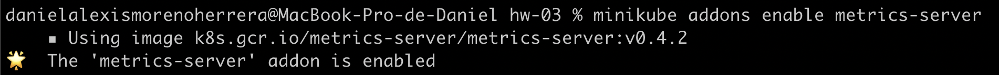
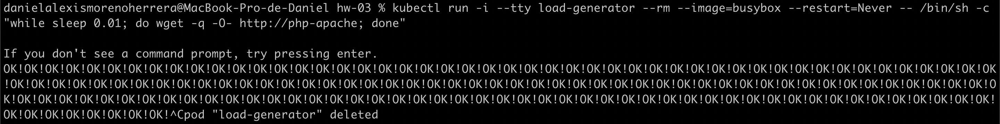
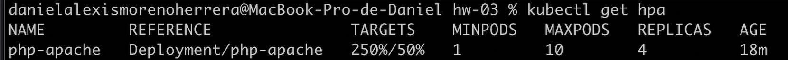
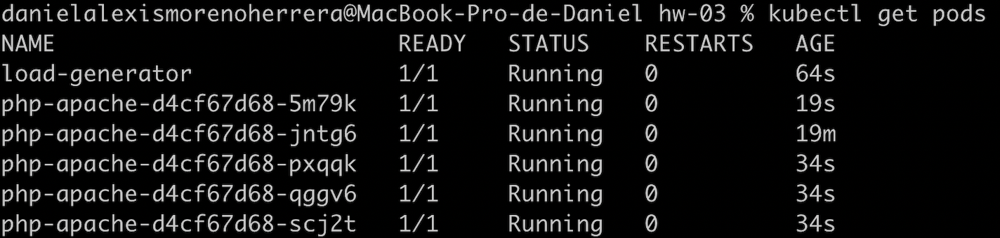

# Answer 3

**Crea un objeto de kubernetes HPA, que escale a partir de las métricas CPU o memoria (a vuestra elección). Establece el umbral al 50% de CPU/memoria utilizada, cuando pase el umbral, automáticamente se deberá escalar al doble de replicas.**

_Respuesta_

1. Genere el deployment y service bajo una imagen php con el siguiente comando:

`kubectl apply -f https://k8s.io/examples/application/php-apache.yaml`

2. Genere el HPA mediante el siguiente comando:

`kubectl autoscale deployment php-apache --cpu-percent=50 --min=1 --max=10`

3. Habilite el addon de metrics-server para verificar el estres mediante el siguiente comando:

`minikube addons enable metrics-server`

4. Realice pruebas de estres mediante el siguiente comando:

`kubectl run -i --tty load-generator --rm --image=busybox --restart=Never -- /bin/sh -c "while sleep 0.01; do wget -q -O- http://php-apache; done"`

5. Verifique el status de los pods y del HPA mediante los siguientes comandos:

`kubectl get hpa`

`kubectl get pods`

Aqui se puede apreciar que subio los pods iniciales en base a la demanda de las pruebas de estres.

6. Obtuve los yml de HPA mediante el siguiente comando:

`kubectl get hpa php-apache -o yaml` = hpa.yml

`kubectl get deployment php-apache -o yaml` = deploymentHPA.yml

`kubectl get svc php-apache -o yaml` = serviceHPA.yml